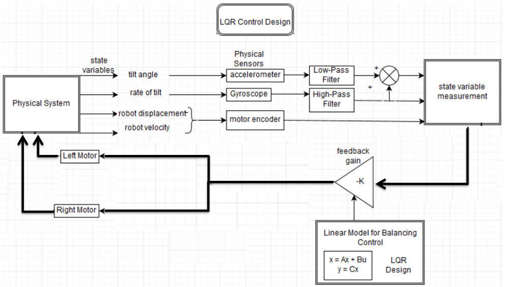
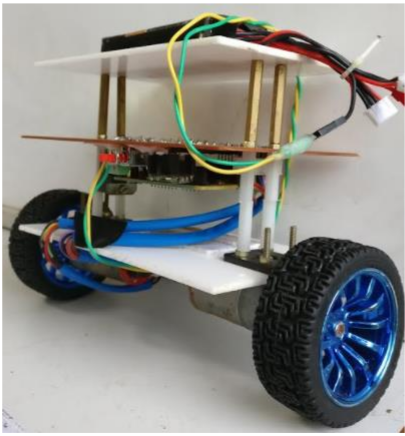

# Self Balancing Bot

This project aims to design, construct, and implement the control of a two-wheel self-balancing robot using PID and LQR Controller.

The two-wheeled self-balancing robot, also known as the inverted pendulum and cart model, is a popular model in control system experiments. It is a multi-input and multi-output system that has theoretical significance and has been applied in many systems in daily use.

## Project Components
- **Hardware:**
  - Pair of DC motors
  - Motor controller
  - Arduino microcontroller board with built-in 3-axis gyroscope and a 3-axis accelerometer
  - Encoders for drift and linear velocity determination

- **Software:**
  - Complementary filter to compensate for accelerometer noise and gyro drifts
  - Implementation of PID and LQR controllers
  - Testing conducted through simulation on Simulink and MATLAB

## Implementation
### Algorithm:

### Model:

## Usage
- Copy the files in the "Libraries" folder to the Arduino Library folder in your PC.
- Compile and Upload SelfBalanceRobot.ino to your Robot

## Report
For further details, please refer to the [Report.pdf](Report.pdf).

